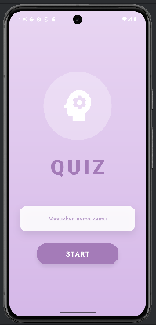
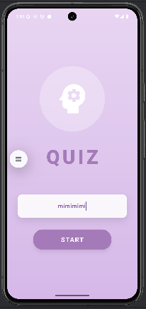
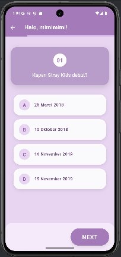
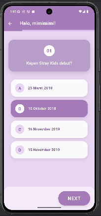
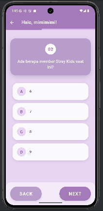
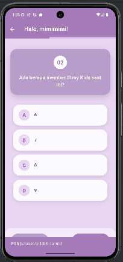
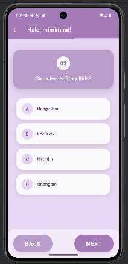
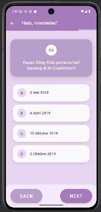
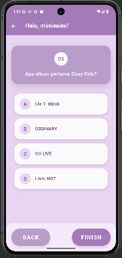
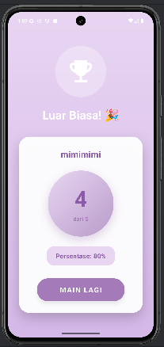

# UTS PM4 
- Nama: Diva Syakirahana
- NIM: 231401077
- Lab: PM4

## Nama Aplikasi
Quiz

## Deskripsi Aplikasi
Aplikasi kuis pilihan ganda yang memungkinkan pengguna:
- Memasukkan nama sebelum memulai kuis
- Menjawab 5 pertanyaan pilihan ganda
- Navigasi antar pertanyaan (next/previous)
- Melihat skor akhir dengan persentase

## Credit
- Font: [Poppins from Google Fonts](https://fonts.google.com/specimen/Poppins)
- Icons: Material Icons (bawaan Flutter)

## Screenshot Aplikasi

### 1. Home Screen

### 2. Quiz Screen

### 3. Result Screen

## Link Mockup/Prototype
https://www.figma.com/design/8fNkdoZyhkRB2qDfmR2Ve6/UTS-PM4?node-id=1-2&t=oNPOCKvn3qWYqskz-1

## Catatan
- Download font Poppins dari: https://fonts.google.com/specimen/Poppins dan letakkan di `assets/fonts/` 
- File yang dibutuhkan: `Poppins-Regular.ttf` dan `Poppins-Bold.ttf`